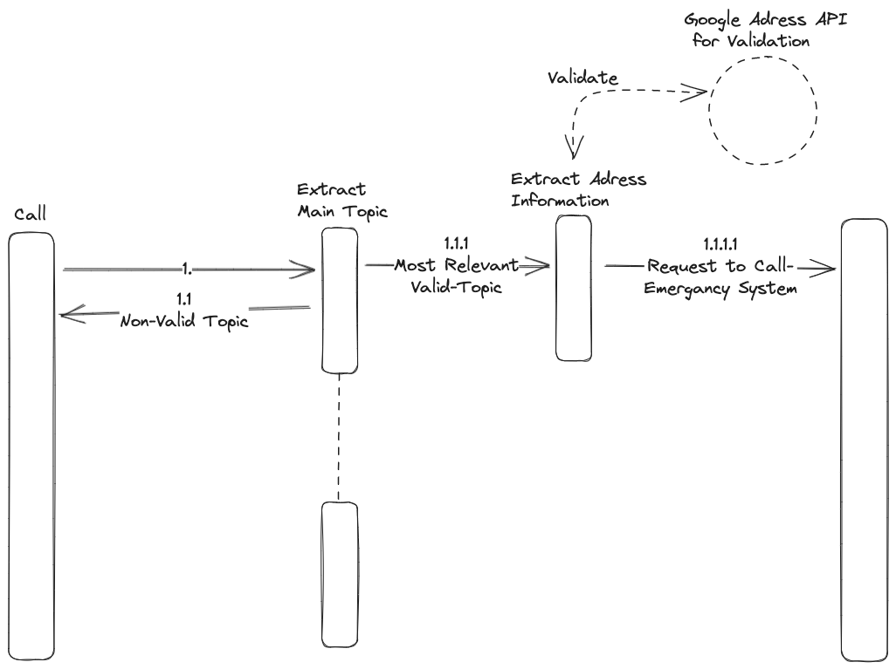

## Main Steps

1. Extract main topic. it means that the step should identify valid or non-valid call contenxt. Valid content is like Fire, Flood, 112 Service call and so on. Non-Valid content is like "Yanıyorum ateşimi söndür fireman"
2. Extract Address information to notify internal call-center system.  Extract *Street*, *Apartmant Name* and so on. These can be extracted one line information like (Tevfikiye Mahallesi 3521 Sokak No:34/1 Manisa/Yunusemre)
	1. This step also extract city information to forward relevant call-center.

### Use-Case Diagram
The diagram shows us happy path scenario. This scenario is composed of #speech2text and #NER purpose models. 
[

#### #speech2text  candidate models;

| Model    | Benchmark |
| -------- | ------- |
| January  | $250    |
------
#### #NER candidate models;
1. LLM Family Models

| Model    | Benchmark |
| -------- | ------- |
| January  | $250    |
2. Conventional Models

| Model    | Benchmark |
| -------- | ------- |
| January  | $250    |

------

